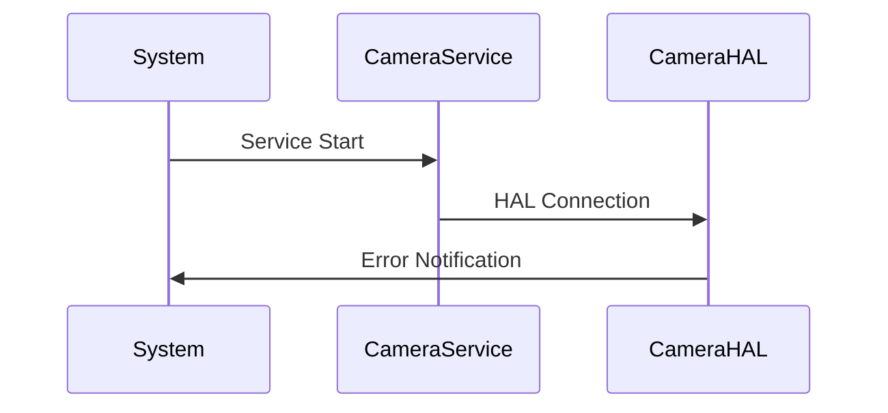
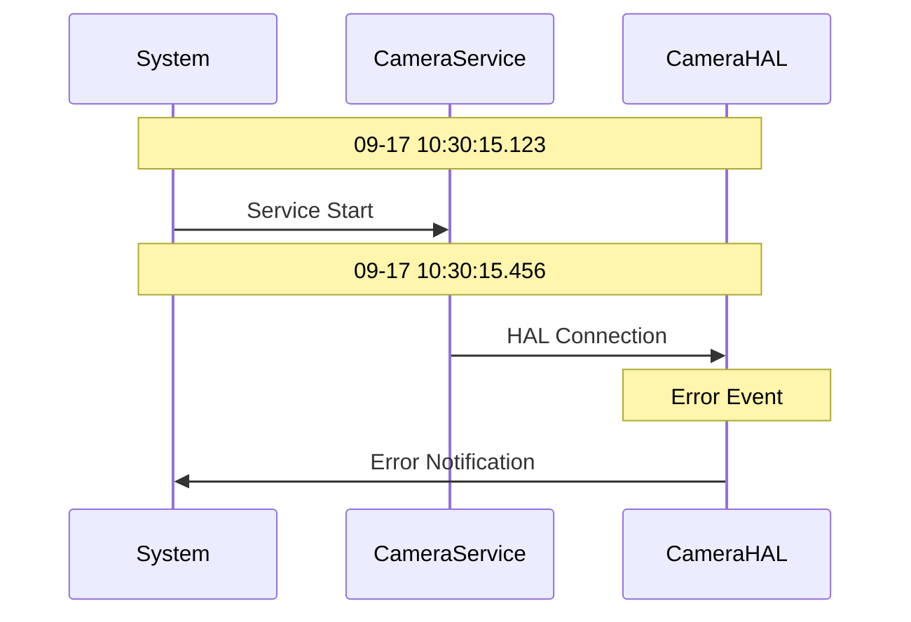

# Quick Compare Module - Code Explanation

## 📁 Module Overview

The `quick_compare` folder contains the **QuickCompareModule** which implements **UC-04.1: Generate Sequence Events** and **UC-04.2: Export Sequence Diagrams**. This module compares logs against templates to generate sequence events and creates Mermaid diagrams for visualization.

## 📂 Files in this Folder

- `quick_compare_module.py` - Main module implementation
- `readme_code_explain.md` - This documentation file

---

## 🔧 `quick_compare_module.py` - Core Implementation

### Class: `QuickCompareModule`

**Purpose**: Handles sequence event generation and diagram export according to use case specifications.

#### Key Attributes:
```python
def __init__(self, config: Optional[Dict[str, Any]] = None):
    super().__init__(config)
    self.max_events_per_diagram = self.config.get('max_events_per_diagram', 1000)
    self.overview_event_limit = self.config.get('overview_event_limit', 20)
    self.output_dir = self.config.get('output_dir', 'output_seq')
    
    # Create output directory
    Path(self.output_dir).mkdir(exist_ok=True)
```

### Main Method 1: `generate_sequence_events()`

**Purpose**: Main flow for UC-04.1 - Generate Sequence Events

```python
def generate_sequence_events(self, log_entries: List[LogEntry], templates: List[Template]) -> List[SequenceEvent]:
    """
    Main flow for UC-04.1: Generate Sequence Events
    
    Steps:
    1. System receives parsed logs and templates
    2. FOR each log entry:
       - FOR each template (by priority):
         - Apply regex pattern to message
         - If match found:
           - Extract groups from pattern
           - Map to sequence entities
           - Create SequenceEvent
           - Break template loop
    3. System collects all sequence events
    4. System preserves chronological order
    5. System enriches with metadata
    6. System returns event collection
    """
```

#### Step-by-Step Process:

##### Step 1: Template Priority Processing
```python
# Step 2: FOR each log entry
for log_entry in log_entries:
    event_created = False
    
    # FOR each template (by priority)
    for template in sorted(templates, key=lambda t: t.priority):
        # Apply regex pattern to message
        match = re.search(template.pattern, log_entry.message)
        
        if match:
            # If match found:
            # Extract groups from pattern
            groups = match.groups()
            
            # Map to sequence entities
            sequence_event = self._create_sequence_event(log_entry, template, groups)
            
            if sequence_event:
                # Create SequenceEvent
                sequence_events.append(sequence_event)
                event_created = True
                
                # Break template loop (first match wins by priority)
                break
```

##### Step 2: Sequence Event Creation
```python
def _create_sequence_event(self, log_entry: LogEntry, template: Template, groups: List[str]) -> Optional[SequenceEvent]:
    """Create sequence event from log entry and template match"""
    try:
        # Map groups to sequence entities
        from_entity = self._map_entity(template.sequence_mapping.get('from', 'Unknown'), groups)
        to_entity = self._map_entity(template.sequence_mapping.get('to', 'Unknown'), groups)
        message = self._map_entity(template.sequence_mapping.get('message', 'Event'), groups)
        
        # Create metadata
        metadata = {
            'template_name': template.name,
            'template_priority': template.priority,
            'log_level': log_entry.level.value,
            'log_tag': log_entry.tag,
            'groups': groups
        }
        
        return SequenceEvent(
            timestamp=log_entry.timestamp,
            from_entity=from_entity,
            to_entity=to_entity,
            message=message,
            event_type=template.name,
            metadata=metadata,
            log_entry=log_entry
        )
        
    except Exception as e:
        self.log_error(f"Error creating sequence event: {str(e)}")
        return None
```

##### Step 3: Entity Mapping
```python
def _map_entity(self, mapping: str, groups: List[str]) -> str:
    """Map template mapping to actual values using regex groups"""
    if not mapping:
        return "Unknown"
    
    # Replace {groupN} with actual group values
    result = mapping
    for i, group in enumerate(groups):
        placeholder = f"{{group{i+1}}}"
        if placeholder in result:
            result = result.replace(placeholder, str(group))
    
    # Replace common placeholders
    result = result.replace("{timestamp}", groups[0] if groups else "")
    result = result.replace("{level}", groups[1] if len(groups) > 1 else "")
    result = result.replace("{tag}", groups[2] if len(groups) > 2 else "")
    result = result.replace("{message}", groups[3] if len(groups) > 3 else "")
    
    # Sanitize for Mermaid (remove special characters)
    result = re.sub(r'[^\w\s-]', '', result)
    result = re.sub(r'\s+', '_', result.strip())
    
    return result or "Unknown"
```

##### Step 4: Chronological Ordering
```python
# Step 3: System collects all sequence events
# Step 4: System preserves chronological order
sequence_events.sort(key=lambda e: e.timestamp)
```

##### Step 5: Metadata Enrichment
```python
def _enrich_events_with_metadata(self, events: List[SequenceEvent]) -> List[SequenceEvent]:
    """Enrich events with additional metadata"""
    # Add sequence numbers
    for i, event in enumerate(events):
        event.metadata['sequence_number'] = i + 1
    
    # Add timing information
    if len(events) > 1:
        for i in range(1, len(events)):
            prev_time = self._parse_timestamp(events[i-1].timestamp)
            curr_time = self._parse_timestamp(events[i].timestamp)
            if prev_time and curr_time:
                duration = (curr_time - prev_time).total_seconds()
                events[i].metadata['time_since_previous'] = duration
    
    return events
```

##### Step 6: Timestamp Parsing
```python
def _parse_timestamp(self, timestamp_str: str) -> Optional[datetime]:
    """Parse timestamp string to datetime object"""
    try:
        # Handle Android logcat format: MM-DD HH:MM:SS.mmm
        if re.match(r'\d{2}-\d{2}\s+\d{2}:\d{2}:\d{2}\.\d{3}', timestamp_str):
            # Use current year for parsing
            current_year = datetime.now().year
            full_timestamp = f"{current_year}-{timestamp_str}"
            return datetime.strptime(full_timestamp, "%Y-%m-%d %H:%M:%S.%f")
    except Exception:
        pass
    return None
```

### Alternative Flows (Error Handling)

#### AF1: No Template Matches
```python
# AF1: No Template Matches
if not event_created:
    unmatched_entries.append(log_entry)
    self.log_debug(f"No template match for log entry: {log_entry.message[:50]}...")
```

#### AF2: Multiple Template Matches
```python
# AF2: Multiple Template Matches
# - System uses highest priority template
# - System logs multiple match scenario
# - Continue with selected template
```

### Main Method 2: `export_sequence_diagrams()`

**Purpose**: Main flow for UC-04.2 - Export Sequence Diagrams

```python
def export_sequence_diagrams(self, sequence_events: List[SequenceEvent]) -> Dict[str, str]:
    """
    Main flow for UC-04.2: Export Sequence Diagrams
    
    Steps:
    1. System prepares sequence events
    2. System generates overview diagram:
       - Extract unique participants
       - Limit to first 20 events
       - Create simplified flow
    3. System generates detailed diagram:
       - Include all events
       - Add timestamps
       - Add metadata notes
    4. System writes both diagrams to files
    5. System validates Mermaid syntax
    6. System reports export success
    """
```

#### Overview Diagram Generation:
```python
def _generate_overview_diagram(self, events: List[SequenceEvent]) -> str:
    """Generate overview diagram with limited events"""
    # AF1: Too Many Events - limit to overview_event_limit
    limited_events = events[:self.overview_event_limit]
    
    # Extract unique participants
    participants = self._extract_participants(limited_events)
    
    content = "# Sequence Overview\n\n"
    content += "```mermaid\n"
    content += "sequenceDiagram\n"
    
    # Add participant declarations
    for participant in participants:
        content += f"    participant {participant}\n"
    
    content += "\n"
    
    # Add events (simplified flow)
    for event in limited_events:
        content += f"    {event.from_entity}->>{event.to_entity}: {event.message}\n"
    
    content += "```\n\n"
    content += f"*Overview showing first {len(limited_events)} events of {len(events)} total*\n"
    
    return content
```

#### Detailed Diagram Generation:
```python
def _generate_detailed_diagram(self, events: List[SequenceEvent]) -> str:
    """Generate detailed diagram with all events and metadata"""
    # AF1: Too Many Events - paginate if necessary
    if len(events) > self.max_events_per_diagram:
        return self._generate_paginated_diagrams(events)
    
    # Extract unique participants
    participants = self._extract_participants(events)
    
    content = "# Detailed Sequence Diagram\n\n"
    content += "```mermaid\n"
    content += "sequenceDiagram\n"
    
    # Add participant declarations
    for participant in participants:
        content += f"    participant {participant}\n"
    
    content += "\n"
    
    # Add events with timestamps and metadata
    for i, event in enumerate(events):
        # Add timestamp note for every 10th event
        if i % 10 == 0:
            content += f"    Note over {participants[0]},{participants[-1]}: {event.timestamp}\n"
        
        # Add event
        content += f"    {event.from_entity}->>{event.to_entity}: {event.message}\n"
        
        # Add metadata note for important events
        if event.metadata.get('log_level') in ['E', 'F']:
            content += f"    Note over {event.to_entity}: Error Event\n"
    
    content += "```\n\n"
    content += f"*Detailed view showing all {len(events)} events with timestamps*\n"
    
    return content
```

#### Pagination for Large Event Sets:
```python
def _generate_paginated_diagrams(self, events: List[SequenceEvent]) -> str:
    """Generate paginated diagrams for large event sets"""
    content = "# Detailed Sequence Diagram (Paginated)\n\n"
    
    total_pages = (len(events) + self.max_events_per_diagram - 1) // self.max_events_per_diagram
    
    for page in range(total_pages):
        start_idx = page * self.max_events_per_diagram
        end_idx = min(start_idx + self.max_events_per_diagram, len(events))
        page_events = events[start_idx:end_idx]
        
        content += f"## Page {page + 1} of {total_pages}\n\n"
        content += self._generate_detailed_diagram(page_events)
        content += "\n"
    
    return content
```

#### Participant Extraction and Sanitization:
```python
def _extract_participants(self, events: List[SequenceEvent]) -> List[str]:
    """Extract unique participants from events"""
    participants = set()
    for event in events:
        participants.add(event.from_entity)
        participants.add(event.to_entity)
    
    # AF2: Invalid Characters - sanitize participant names
    sanitized_participants = []
    for participant in sorted(participants):
        sanitized = self._sanitize_participant_name(participant)
        sanitized_participants.append(sanitized)
    
    return sanitized_participants

def _sanitize_participant_name(self, name: str) -> str:
    """Sanitize participant name for Mermaid"""
    # Remove special characters and replace with underscores
    sanitized = re.sub(r'[^\w\s-]', '', name)
    sanitized = re.sub(r'\s+', '_', sanitized.strip())
    
    # Ensure it starts with a letter
    if sanitized and not sanitized[0].isalpha():
        sanitized = f"P_{sanitized}"
    
    return sanitized or "Unknown"
```

#### File Writing and Validation:
```python
def _write_diagram_file(self, filename: str, content: str) -> str:
    """Write diagram content to file"""
    output_path = Path(self.output_dir) / filename
    
    try:
        with open(output_path, 'w', encoding='utf-8') as file:
            file.write(content)
        
        self.log_debug(f"Written diagram to {output_path}")
        return str(output_path)
        
    except Exception as e:
        self.log_error(f"Error writing diagram file {filename}: {str(e)}")
        return ""

def _validate_mermaid_syntax(self, overview_content: str, detailed_content: str) -> Dict[str, Any]:
    """Validate Mermaid syntax in diagrams"""
    validation_result = {
        'valid': True,
        'errors': []
    }
    
    # Basic validation - check for required Mermaid elements
    required_elements = ['sequenceDiagram', 'participant', '->>']
    
    for content_name, content in [('overview', overview_content), ('detailed', detailed_content)]:
        for element in required_elements:
            if element not in content:
                validation_result['errors'].append(f"Missing {element} in {content_name} diagram")
                validation_result['valid'] = False
    
    return validation_result
```

### Alternative Flows (Error Handling)

#### AF1: Too Many Events
```python
# AF1: Too Many Events - paginate diagram
# - System paginates diagram
# - System creates multiple files
# - System adds navigation links
# - Continue with pagination
```

#### AF2: Invalid Characters
```python
# AF2: Invalid Characters - sanitize entity names
# - System sanitizes names
# - System logs transformations
# - Continue with clean names
```

### Business Rules Implementation

#### BR1: First matching template wins (by priority)
```python
# Templates are sorted by priority and first match wins
for template in sorted(templates, key=lambda t: t.priority):
    match = re.search(template.pattern, log_entry.message)
    if match:
        # Create event and break (first match wins)
        sequence_events.append(sequence_event)
        break
```

#### BR2: Preserve timestamp accuracy to milliseconds
```python
def _parse_timestamp(self, timestamp_str: str) -> Optional[datetime]:
    """Parse timestamp string to datetime object"""
    try:
        # Handle Android logcat format: MM-DD HH:MM:SS.mmm
        if re.match(r'\d{2}-\d{2}\s+\d{2}:\d{2}:\d{2}\.\d{3}', timestamp_str):
            # Use current year for parsing
            current_year = datetime.now().year
            full_timestamp = f"{current_year}-{timestamp_str}"
            return datetime.strptime(full_timestamp, "%Y-%m-%d %H:%M:%S.%f")
    except Exception:
        pass
    return None
```

#### BR3: Entity names must be valid Mermaid identifiers
```python
def _sanitize_participant_name(self, name: str) -> str:
    """Sanitize participant name for Mermaid"""
    # Remove special characters and replace with underscores
    sanitized = re.sub(r'[^\w\s-]', '', name)
    sanitized = re.sub(r'\s+', '_', sanitized.strip())
    
    # Ensure it starts with a letter
    if sanitized and not sanitized[0].isalpha():
        sanitized = f"P_{sanitized}"
    
    return sanitized or "Unknown"
```

#### BR4: Maximum 1000 events per diagram by default
```python
self.max_events_per_diagram = self.config.get('max_events_per_diagram', 1000)

# Check if events exceed limit
if len(events) > self.max_events_per_diagram:
    return self._generate_paginated_diagrams(events)
```

### Utility Methods

#### Statistics Generation:
```python
def get_sequence_statistics(self, events: List[SequenceEvent]) -> Dict[str, Any]:
    """Get statistics about sequence events"""
    if not events:
        return {}
    
    # Count events by type
    event_types = {}
    for event in events:
        event_type = event.event_type
        event_types[event_type] = event_types.get(event_type, 0) + 1
    
    # Count events by participant
    participant_counts = {}
    for event in events:
        participant_counts[event.from_entity] = participant_counts.get(event.from_entity, 0) + 1
        participant_counts[event.to_entity] = participant_counts.get(event.to_entity, 0) + 1
    
    # Calculate timing statistics
    timestamps = [self._parse_timestamp(event.timestamp) for event in events]
    timestamps = [t for t in timestamps if t is not None]
    
    timing_stats = {}
    if len(timestamps) > 1:
        durations = [(timestamps[i] - timestamps[i-1]).total_seconds() 
                    for i in range(1, len(timestamps))]
        timing_stats = {
            'total_duration': (timestamps[-1] - timestamps[0]).total_seconds(),
            'average_interval': sum(durations) / len(durations),
            'min_interval': min(durations),
            'max_interval': max(durations)
        }
    
    return {
        'total_events': len(events),
        'event_types': event_types,
        'participant_counts': participant_counts,
        'timing_stats': timing_stats,
        'first_event': events[0].timestamp if events else None,
        'last_event': events[-1].timestamp if events else None
    }
```

#### Business Rule Validation:
```python
def validate_business_rules(self, events: List[SequenceEvent]) -> Dict[str, Any]:
    """
    Validate business rules for sequence generation
    BR1: First matching template wins (by priority)
    BR2: Preserve timestamp accuracy to milliseconds
    BR3: Entity names must be valid Mermaid identifiers
    BR4: Maximum 1000 events per diagram by default
    """
    validation_result = {
        'valid': True,
        'warnings': [],
        'errors': []
    }
    
    # BR2: Check timestamp accuracy
    for event in events:
        if not re.match(r'\d{2}-\d{2}\s+\d{2}:\d{2}:\d{2}\.\d{3}', event.timestamp):
            validation_result['warnings'].append(f"Event {event.event_type} has non-millisecond timestamp")
    
    # BR3: Check entity names
    for event in events:
        if not re.match(r'^[a-zA-Z_][a-zA-Z0-9_]*$', event.from_entity):
            validation_result['warnings'].append(f"Invalid entity name: {event.from_entity}")
        if not re.match(r'^[a-zA-Z_][a-zA-Z0-9_]*$', event.to_entity):
            validation_result['warnings'].append(f"Invalid entity name: {event.to_entity}")
    
    # BR4: Check event count
    if len(events) > self.max_events_per_diagram:
        validation_result['warnings'].append(f"Event count {len(events)} exceeds diagram limit {self.max_events_per_diagram}")
    
    return validation_result
```

---

## 🧪 Testing and Usage

### Basic Usage:
```python
from quick_compare.quick_compare_module import QuickCompareModule

# Initialize module
config = {'debug': True}
quick_compare_module = QuickCompareModule(config)

# Create sample data
from data_models import LogEntry, LogLevel, Template

sample_logs = [
    LogEntry("09-17 10:30:15.123", LogLevel.INFO, "ActivityManager", "Starting CameraActivity", "original", 1),
    LogEntry("09-17 10:30:15.456", LogLevel.DEBUG, "CameraService", "Camera initialized", "original", 2),
    LogEntry("09-17 10:30:15.789", LogLevel.ERROR, "CameraHAL", "Hardware error", "original", 3)
]

sample_templates = [
    Template("Camera Start", r".*Camera.*", {"from": "System", "to": "Camera", "message": "Start"}, 1),
    Template("Camera Error", r".*error.*", {"from": "Camera", "to": "System", "message": "Error"}, 2)
]

# Generate sequence events
events = quick_compare_module.generate_sequence_events(sample_logs, sample_templates)
print(f"Generated {len(events)} sequence events")

# Export diagrams
diagram_paths = quick_compare_module.export_sequence_diagrams(events)
print(f"Exported diagrams: {diagram_paths}")
```

### Advanced Usage:
```python
# Get statistics
stats = quick_compare_module.get_sequence_statistics(events)
print(f"Event types: {stats['event_types']}")
print(f"Participant counts: {stats['participant_counts']}")

# Validate business rules
validation = quick_compare_module.validate_business_rules(events)
if validation['valid']:
    print("All business rules satisfied")
else:
    print(f"Warnings: {validation['warnings']}")
```

---

## 🔧 Configuration Options

### Default Configuration:
```python
config = {
    'max_events_per_diagram': 1000,
    'overview_event_limit': 20,
    'output_dir': 'output_seq'
}
```

### Custom Configuration:
```python
config = {
    'max_events_per_diagram': 500,  # Smaller diagrams
    'overview_event_limit': 10,     # Fewer overview events
    'output_dir': 'custom_output',  # Custom output directory
    'debug': True
}
quick_compare_module = QuickCompareModule(config)
```

---

## 📈 Performance Characteristics

### Event Generation:
- **Template Matching**: O(n*m) where n=log entries, m=templates
- **Priority Sorting**: O(m log m) for template sorting
- **Entity Mapping**: O(1) per event

### Diagram Generation:
- **Participant Extraction**: O(n) where n=events
- **Content Generation**: O(n) for event processing
- **File Writing**: O(n) for content output

### Memory Usage:
- **Event Storage**: Linear with number of events
- **Diagram Content**: Generated on-demand
- **Temporary Data**: Minimal overhead

---

## 🛡️ Error Handling

### Event Generation Errors:
- **Template Mismatch**: Graceful handling with logging
- **Invalid Groups**: Fallback to default values
- **Mapping Errors**: Error logging with continuation

### Diagram Generation Errors:
- **Invalid Characters**: Automatic sanitization
- **Large Event Sets**: Automatic pagination
- **File Write Errors**: Graceful error handling

### Validation Errors:
- **Business Rule Violations**: Warning generation
- **Syntax Errors**: Clear error messages
- **Performance Issues**: Automatic optimization

---

## 🔄 Integration with Other Modules

### Input from ReadLogModule:
```python
# ReadLogModule provides parsed entries
parsed_entries = read_log_module.parse_log_entries(log_lines)

# QuickCompareModule generates events
events = quick_compare_module.generate_sequence_events(parsed_entries, templates)
```

### Input from TemplateSequenceModule:
```python
# TemplateSequenceModule provides templates
templates = template_module.load_template_configuration()

# QuickCompareModule uses templates for matching
events = quick_compare_module.generate_sequence_events(log_entries, templates)
```

### Output to ExportSequenceModule:
```python
# QuickCompareModule provides events
events = quick_compare_module.generate_sequence_events(log_entries, templates)

# ExportSequenceModule exports to JSON
json_path = export_sequence_module.export_to_json_format(events, log_entries, templates)
```

### Output to ExportTestEvidenceModule:
```python
# QuickCompareModule provides events
events = quick_compare_module.generate_sequence_events(log_entries, templates)

# ExportTestEvidenceModule includes in reports
evidence_path = export_evidence_module.generate_test_evidence_report(
    test_id, log_file_path, events, log_entries
)
```

---

## 📊 Generated Diagram Examples

### Overview Diagram:


### Detailed Diagram:


---

This QuickCompareModule provides the core sequence generation and visualization capabilities, transforming raw log data into meaningful sequence diagrams that illustrate system interactions and workflows. It serves as the bridge between log parsing and final output generation.
