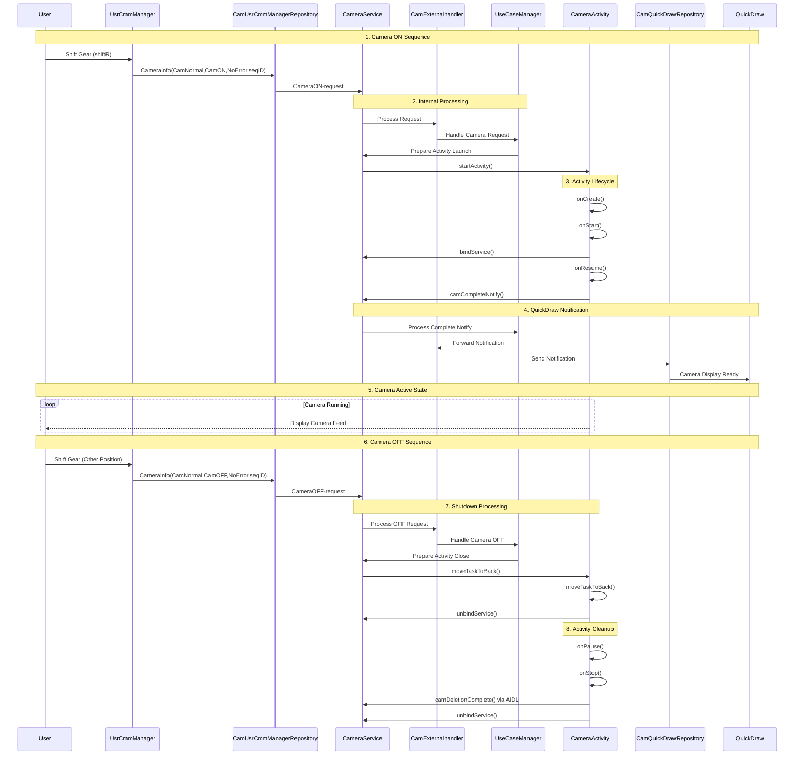

# Automotive CameraApp Flow - Custom Overview Template
**@author: toantv24**

High-level sequence diagram for automotive camera systems with custom service architecture. This template demonstrates gear-shift triggered camera activation using a repository pattern with AIDL communication and QuickDraw integration for optimal performance.

**Architecture Highlights:**
- **Gear-driven activation**: Automatic camera ON/OFF based on vehicle state
- **Repository pattern**: Clean separation between UI and business logic
- **AIDL integration**: Inter-process communication for system services
- **QuickDraw optimization**: Fast camera startup for safety-critical scenarios
- **Activity lifecycle management**: Proper resource handling for embedded systems

**Use Cases:**
- Reverse camera activation on gear shift
- Side camera activation for lane change
- Parking assistance camera coordination



## Expected Flow Steps

### Camera ON Sequence
1. **Gear Shift**: User shifts to reverse gear
2. **Request Generation**: UsrCmmManager creates CameraON request
3. **Service Processing**: Internal service chain processes request
4. **Activity Launch**: CameraService starts CameraActivity
5. **Activity Binding**: Activity binds to CameraService
6. **Completion Notify**: Activity signals display complete
7. **QuickDraw Notify**: Service notifies QuickDraw system

### Camera OFF Sequence
1. **Gear Change**: User shifts away from reverse
2. **OFF Request**: UsrCmmManager creates CameraOFF request
3. **Task Management**: Activity moves to background
4. **Service Unbind**: Activity unbinds from service
5. **Lifecycle Cleanup**: Activity cleanup through onPause/onStop
6. **Deletion Complete**: Final cleanup notification

## Critical Points to Monitor

- CameraInfo message format correctness
- bindService/unbindService pairing
- camCompleteNotify() → QuickDraw flow
- camDeletionComplete() AIDL call
- Activity lifecycle sequence (onCreate→onStart→onResume→onPause→onStop)
- Service chain: CamExternalhandler→UseCaseManager→CameraService

## Supported Activities
- **CameraActivity**: Main camera display
- **CameraDiagActivity**: Diagnostic mode  
- **CamPKSActivity**: PKS mode (no lifecycle binding required)

## Architecture Deep Dive

### Message Format Specification
```java
// CameraInfo AIDL message structure
public class CameraInfo {
    public enum CameraMode { CamNormal, CamDiag, CamPKS }
    public enum CameraState { CamON, CamOFF }
    public enum ErrorCode { NoError, HardwareError, TimeoutError }
    
    public CameraMode mode;
    public CameraState state;
    public ErrorCode error;
    public int sequenceId;
}
```

### Service Architecture
```
UsrCmmManager (Vehicle Integration Layer)
    ↓
CamUsrCmmManagerRepository (Data Layer)
    ↓
CameraService (Business Logic Layer)
    ↓
CamExternalHandler → UseCaseManager (Processing Layer)
    ↓
CameraActivity (Presentation Layer)
```

### AIDL Interface Examples
```java
// ICameraService.aidl
interface ICameraService {
    void requestCameraOn(in CameraInfo cameraInfo);
    void requestCameraOff(in CameraInfo cameraInfo);
    void camCompleteNotify();
    void camDeletionComplete();
}

// IVehicleCommManager.aidl  
interface IVehicleCommManager {
    void onGearChanged(int gearPosition);
    void registerGearListener(IVehicleGearListener listener);
}
```

## Performance Requirements

### Timing Specifications
- **Gear detection to camera ON**: < 200ms
- **Camera initialization**: < 800ms  
- **First frame display**: < 1200ms
- **Camera OFF to resource release**: < 500ms
- **Activity lifecycle transitions**: < 100ms each

### Memory Management
- **Max heap usage**: 64MB for camera operations
- **Buffer allocation**: Ring buffer with 3 frame capacity
- **Service binding**: Weak references to prevent memory leaks

## Error Handling Scenarios

### Common Failure Points
1. **Service binding failures**
   ```java
   // Retry mechanism for service binding
   private static final int MAX_BIND_RETRIES = 3;
   private static final int BIND_RETRY_DELAY_MS = 100;
   ```

2. **Camera hardware errors**
   - Hardware unavailable
   - Permission denied
   - Concurrent access conflicts

3. **Vehicle communication errors**
   - CAN bus timeouts
   - Invalid gear position data
   - Vehicle service disconnection

### Recovery Strategies
```java
// Error recovery in CameraService
public void handleCameraError(ErrorCode error) {
    switch (error) {
        case HardwareError:
            // Reinitialize camera hardware
            reinitializeCamera();
            break;
        case TimeoutError:
            // Reset communication channels
            resetVehicleConnection();
            break;
        default:
            // Fallback to safe mode
            enableSafeMode();
    }
}
```

## Testing Guidelines

### Unit Testing Checkpoints
- [ ] CameraInfo message serialization/deserialization
- [ ] Service binding/unbinding cycles
- [ ] Activity lifecycle state transitions
- [ ] AIDL interface method calls
- [ ] Error handling and recovery mechanisms

### Integration Testing
- [ ] End-to-end gear shift to camera display flow
- [ ] Multi-activity scenario testing
- [ ] Service crash recovery testing
- [ ] Memory leak detection over 1000+ cycles
- [ ] Performance benchmarking under load

### Automotive Validation
- [ ] Temperature range testing (-40°C to +85°C)
- [ ] Vibration resistance testing
- [ ] Power cycle resilience (ignition ON/OFF)
- [ ] CAN bus signal integrity verification
- [ ] Electromagnetic compatibility (EMC) testing

## Safety Considerations

### ISO 26262 Compliance
- **ASIL-B** rating for reverse camera functionality
- **Fail-safe behavior**: Default to no-camera state on errors
- **Redundancy**: Backup camera activation mechanisms
- **Monitoring**: Continuous health checks of critical components

### Real-World Deployment
- **Boot time optimization**: Camera ready within 3 seconds of ignition
- **Multi-ECU coordination**: Integration with body control modules
- **OTA update compatibility**: Version-aware AIDL interfaces
- **Diagnostic logging**: Comprehensive error reporting for field diagnostics