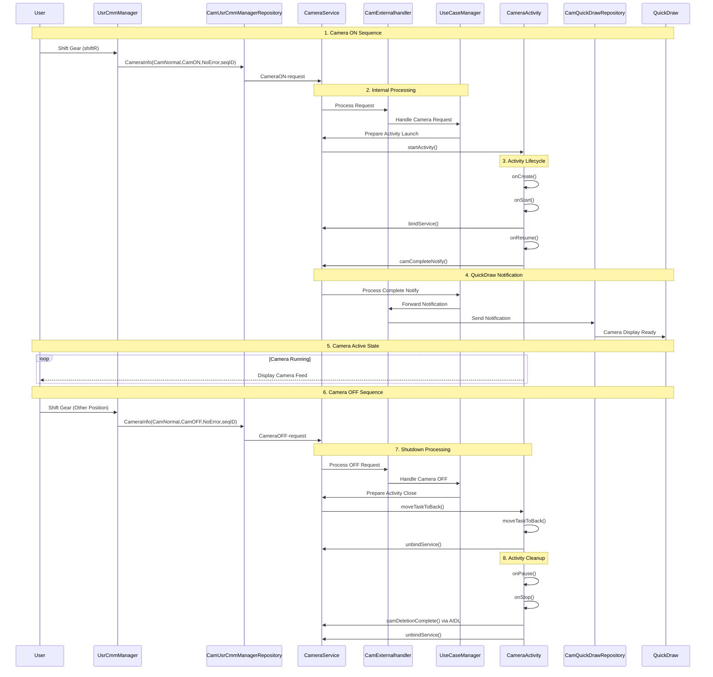

# CameraApp Flow - Custom Overview Template
**@author: toantv24**

High-level sequence diagram for CameraApp. 
Pre-define for using in quick debug from logcat

```mermaid
sequenceDiagram
    participant User
    participant UsrCmmManager
    participant CamUsrCmmManagerRepository
    participant CameraService
    participant CamExternalhandler
    participant UseCaseManager
    participant CameraActivity
    participant CamQuickDrawRepository
    participant QuickDraw
    
    Note over User,QuickDraw: 1. Camera ON Sequence
    User->>UsrCmmManager: Shift Gear (shiftR)
    UsrCmmManager->>CamUsrCmmManagerRepository: CameraInfo(CamNormal,CamON,NoError,seqID)
    CamUsrCmmManagerRepository->>CameraService: CameraON-request
    
    Note over CameraService,UseCaseManager: 2. Internal Processing
    CameraService->>CamExternalhandler: Process Request
    CamExternalhandler->>UseCaseManager: Handle Camera Request
    UseCaseManager->>CameraService: Prepare Activity Launch
    CameraService->>CameraActivity: startActivity()
    
    Note over CameraActivity: 3. Activity Lifecycle
    CameraActivity->>CameraActivity: onCreate()
    CameraActivity->>CameraActivity: onStart()
    CameraActivity->>CameraService: bindService()
    CameraActivity->>CameraActivity: onResume()
    CameraActivity->>CameraService: camCompleteNotify()
    
    Note over CameraService,QuickDraw: 4. QuickDraw Notification
    CameraService->>UseCaseManager: Process Complete Notify
    UseCaseManager->>CamExternalhandler: Forward Notification
    CamExternalhandler->>CamQuickDrawRepository: Send Notification
    CamQuickDrawRepository->>QuickDraw: Camera Display Ready
    
    Note over User,QuickDraw: 5. Camera Active State
    loop Camera Running
        CameraActivity-->>User: Display Camera Feed
    end
    
    Note over User,QuickDraw: 6. Camera OFF Sequence
    User->>UsrCmmManager: Shift Gear (Other Position)
    UsrCmmManager->>CamUsrCmmManagerRepository: CameraInfo(CamNormal,CamOFF,NoError,seqID)
    CamUsrCmmManagerRepository->>CameraService: CameraOFF-request
    
    Note over CameraService,CameraActivity: 7. Shutdown Processing
    CameraService->>CamExternalhandler: Process OFF Request
    CamExternalhandler->>UseCaseManager: Handle Camera OFF
    UseCaseManager->>CameraService: Prepare Activity Close
    CameraService->>CameraActivity: moveTaskToBack()
    CameraActivity->>CameraActivity: moveTaskToBack()
    CameraActivity->>CameraService: unbindService()
    
    Note over CameraActivity: 8. Activity Cleanup
    CameraActivity->>CameraActivity: onPause()
    CameraActivity->>CameraActivity: onStop()
    CameraActivity->>CameraService: camDeletionComplete() via AIDL
    CameraActivity->>CameraService: unbindService()
```