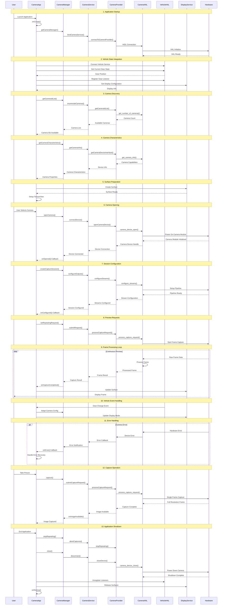

# Automotive CameraApp Flow - Detail Template
**@author: toantv24**

Detail-level sequence diagram for CameraApp. 
Pre-define for using in quick debug from logcat

```mermaid
sequenceDiagram
    participant User
    participant CameraApp
    participant CameraManager
    participant CameraService
    participant CameraProvider
    participant CameraHAL
    participant VehicleHAL
    participant DisplayService
    participant Hardware
    
    Note over User,Hardware: 1. Application Startup
    User->>CameraApp: Launch Application
    CameraApp->>CameraApp: onCreate()
    CameraApp->>CameraManager: getCameraManager()
    CameraManager->>CameraService: bindCameraService()
    CameraService->>CameraProvider: connectToCameraProvider()
    CameraProvider->>CameraHAL: HIDL Connection
    CameraHAL->>Hardware: HAL Initialize
    Hardware-->>CameraHAL: HAL Ready
    
    Note over User,Hardware: 2. Vehicle State Integration
    CameraApp->>VehicleHAL: Connect Vehicle Service
    CameraApp->>VehicleHAL: Get Current Gear State
    VehicleHAL-->>CameraApp: Gear Position
    CameraApp->>VehicleHAL: Register Gear Listener
    CameraApp->>DisplayService: Get Display Configuration
    DisplayService-->>CameraApp: Display Info
    
    Note over User,Hardware: 3. Camera Discovery
    CameraApp->>CameraManager: getCameraIdList()
    CameraManager->>CameraService: enumerateCameras()
    CameraService->>CameraProvider: getCameraIdList()
    CameraProvider->>CameraHAL: get_number_of_cameras()
    CameraHAL-->>CameraProvider: Camera Count
    CameraProvider-->>CameraService: Available Cameras
    CameraService-->>CameraManager: Camera List
    CameraManager-->>CameraApp: Camera IDs Available
    
    Note over User,Hardware: 4. Camera Characteristics
    CameraApp->>CameraManager: getCameraCharacteristics()
    CameraManager->>CameraService: getCameraInfo()
    CameraService->>CameraProvider: getCameraDeviceInterface()
    CameraProvider->>CameraHAL: get_camera_info()
    CameraHAL-->>CameraProvider: Camera Capabilities
    CameraProvider-->>CameraService: Device Info
    CameraService-->>CameraManager: Camera Characteristics
    CameraManager-->>CameraApp: Camera Properties
    
    Note over User,Hardware: 5. Surface Preparation
    CameraApp->>DisplayService: Create Surface
    DisplayService-->>CameraApp: Surface Ready
    CameraApp->>CameraApp: Setup TextureView
    
    Note over User,Hardware: 6. Camera Opening
    User->>CameraApp: User Selects Camera
    CameraApp->>CameraManager: openCamera()
    CameraManager->>CameraService: connectDevice()
    CameraService->>CameraProvider: openCameraDevice()
    CameraProvider->>CameraHAL: camera_device_open()
    CameraHAL->>Hardware: Power On Camera Module
    Hardware-->>CameraHAL: Camera Module Initialized
    CameraHAL-->>CameraProvider: Camera Device Handle
    CameraProvider-->>CameraService: Device Connection
    CameraService-->>CameraManager: Device Connected
    CameraManager-->>CameraApp: onOpened() Callback
    
    Note over User,Hardware: 7. Session Configuration
    CameraApp->>CameraManager: createCaptureSession()
    CameraManager->>CameraService: configureOutputs()
    CameraService->>CameraProvider: configureStreams()
    CameraProvider->>CameraHAL: configure_streams()
    CameraHAL->>Hardware: Setup Pipeline
    Hardware-->>CameraHAL: Pipeline Ready
    CameraHAL-->>CameraProvider: Stream Configuration
    CameraProvider-->>CameraService: Streams Configured
    CameraService-->>CameraManager: Session Configured
    CameraManager-->>CameraApp: onConfigured() Callback
    
    Note over User,Hardware: 8. Preview Requests
    CameraApp->>CameraManager: setRepeatingRequest()
    CameraManager->>CameraService: submitRequest()
    CameraService->>CameraProvider: processCaptureRequest()
    CameraProvider->>CameraHAL: process_capture_request()
    CameraHAL->>Hardware: Start Frame Capture
    
    Note over User,Hardware: 9. Frame Processing Loop
    loop Continuous Preview
        Hardware-->>CameraHAL: Raw Frame Data
        CameraHAL->>CameraHAL: Process Frame
        CameraHAL-->>CameraProvider: Processed Frame
        CameraProvider-->>CameraService: Frame Result
        CameraService-->>CameraManager: Capture Result
        CameraManager-->>CameraApp: onCaptureCompleted()
        CameraApp->>DisplayService: Update Surface
        DisplayService-->>User: Display Frame
    end
    
    Note over User,Hardware: 10. Vehicle Event Handling
    VehicleHAL->>CameraApp: Gear Change Event
    CameraApp->>CameraManager: Adapt Camera Config
    CameraApp->>DisplayService: Update Display Mode
    
    Note over User,Hardware: 11. Error Handling
    alt Camera Error
        Hardware->>CameraHAL: Hardware Error
        CameraHAL->>CameraProvider: Device Error
        CameraProvider->>CameraService: Error Callback
        CameraService->>CameraManager: Error Notification
        CameraManager->>CameraApp: onError() Callback
        CameraApp->>CameraApp: Handle Error Recovery
    end
    
    Note over User,Hardware: 12. Capture Operation
    User->>CameraApp: Take Picture
    CameraApp->>CameraManager: capture()
    CameraManager->>CameraService: submitCaptureRequest()
    CameraService->>CameraProvider: processCaptureRequest()
    CameraProvider->>CameraHAL: process_capture_request()
    CameraHAL->>Hardware: Single Frame Capture
    Hardware-->>CameraHAL: Full Resolution Frame
    CameraHAL-->>CameraProvider: Capture Complete
    CameraProvider-->>CameraService: Image Available
    CameraService-->>CameraManager: onImageAvailable()
    CameraManager-->>CameraApp: Image Captured
    
    Note over User,Hardware: 13. Application Shutdown
    User->>CameraApp: Exit Application
    CameraApp->>CameraManager: stopRepeating()
    CameraManager->>CameraService: abortCaptures()
    CameraService->>CameraProvider: stopRepeating()
    CameraApp->>CameraManager: close()
    CameraManager->>CameraService: disconnect()
    CameraService->>CameraProvider: closeDevice()
    CameraProvider->>CameraHAL: camera_device_close()
    CameraHAL->>Hardware: Power Down Camera
    Hardware-->>CameraHAL: Shutdown Complete
    CameraApp->>VehicleHAL: Unregister Listeners
    CameraApp->>DisplayService: Release Surfaces
    CameraApp->>CameraApp: onDestroy()
```